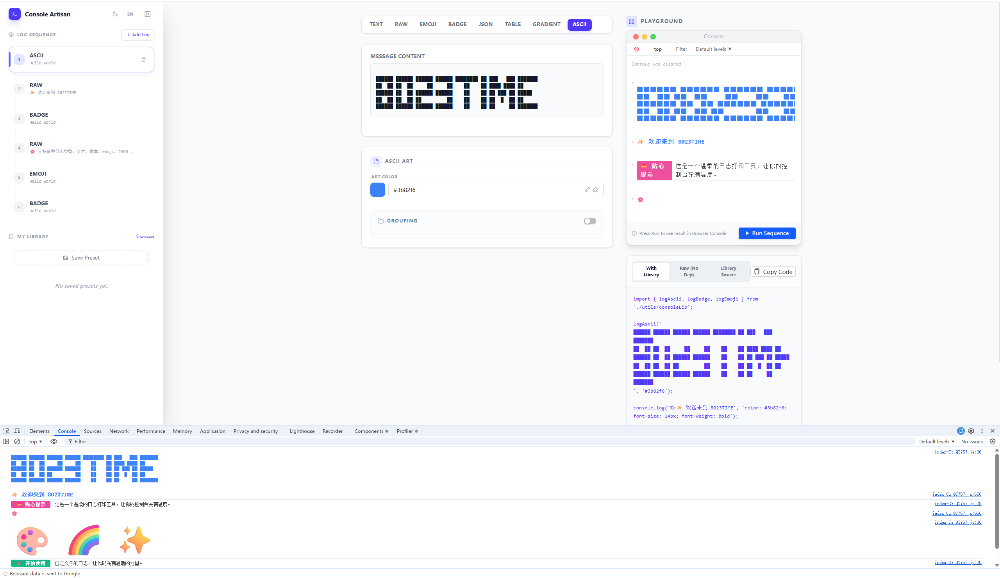
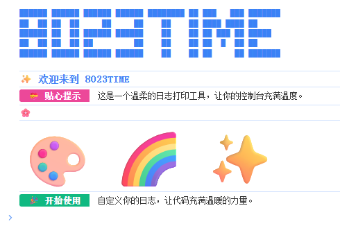

[中文版本](./README-zh.md)

# Console Brand Online

**Console Brand Online** is a web-based platform for generating highly customizable, visually striking console logs directly in your browser. No installation or setup required — adjust styles, colors, badges, gradients, ASCII art, or emojis via a visual interface and copy the generated code instantly.

---

## Demo

  

    ---

  

## Key Features

- **Online Customization**  
  Use a visual control panel to tweak text, badges, gradients, colors, fonts, shadows, and border-radius with real-time preview.

- **Rich Output Formats**  
  - Badge (Label | Value)  
  - Gradient-highlighted text  
  - ASCII art and logos  
  - Large-size emojis  
  - Styled object/JSON and table output

- **Quick Presets**  
  Built-in presets for success, error, warning, and neon styles — generate professional-looking console logs instantly.

- **Copy & Use**  
  Generated code can be copied directly into projects without any dependencies.

---

## Use Cases

- Generate branded console logs online  
- Highlight debug information in projects  
- Provide eye-catching console output for open-source projects or internal tools  
- Showcase logos, ASCII art, or emojis for brand identity

---

## Technical Highlights

- **Pure front-end implementation**, no installation required  
- **Visual, interactive interface** for real-time style adjustments  
- **TypeScript and modern browser compatible**  
- **Supports advanced styles**: gradients, shadows, fonts, border-radius, etc.
